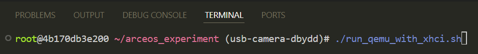
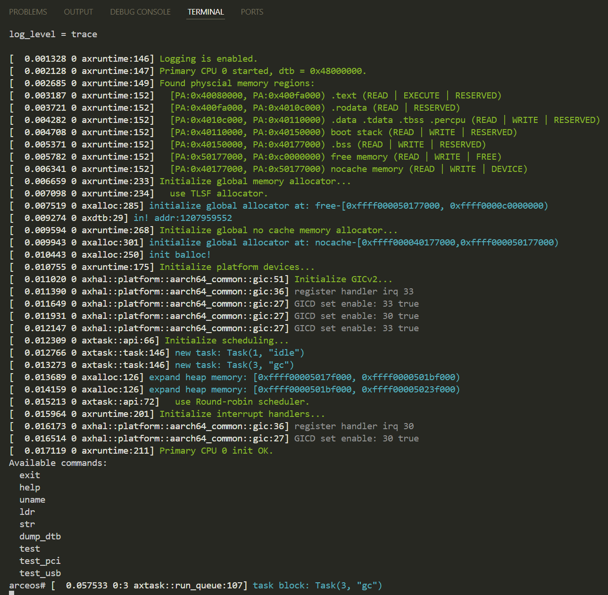
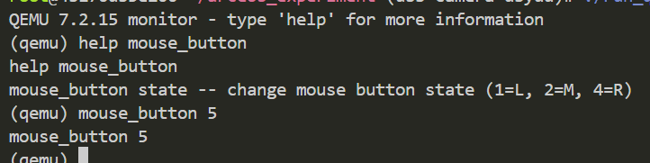

## Docker安装方法

### windows11下的docker安装

对于WINDOWS平台，通常使用Docker Desktop进行docker的管理，要安装docker
desktop，需要首先启用windows的hyper-v虚拟层及容器化功能，此外还需要开启Windows
Subsystem For Linux以确保无特殊问题：

<figure>

<figcaption>
图 5.1 启用Hyper-V
</figcaption>
</figure>

<figure>

<figcaption>
图 5.2 启用虚拟化平台
</figcaption>
</figure>

<figure>

<figcaption>
图 5.3 启用Windows Subsystem for Linux
</figcaption>
</figure>

随后，安装Docker
Desktop：[（此处使用阿里云官方提供的镜像下载）](https://mirrors.aliyun.com/docker-toolbox/windows/docker-for-windows/stable/?spm=a2c6h.25603864.0.0.31bf5d5ekmInmD)

安装完成后启动docker，若发生连接问题，请使用国内镜像源：[使用教程](https://cloud.tencent.com/developer/article/2485043)

验证是否正常工作的方法为：打开命令行或powershell，并输入docker：

{width="4.659722222222222in"
height="2.9652777777777777in"}

若出现命令使用说明，则表示工作正常。

### linux/mac os下的安装方法：

Linux可直接使用各linux发行版自身的包管理进行安装，示例如下，实际命令以你的发行版为准。

Ubuntu/Debian: sudo apt install docker

Mac亦可以使用docker desktop的下载方法，或使用HomeBrew进行安装：

brew install docker

{width="3.2604166666666665in"
height="2.1458333333333335in"}

## 所提供的系统镜像安装方式

- 镜像提供两种分发渠道：docker hub或百度网盘

- 若有docker使用经验并配置好了代理，则可以使用docker
  hub直接拉取镜像，命令为：

docker pull dbydd/axusb-host-example:v2

- 若选择使用百度网盘获取镜像，则镜像链接为：

  通过网盘分享的文件：axusb-host-example.tar

  链接: https://pan.baidu.com/s/1BTsLKq66D9Xxm5XYi2liOg?pwd=wjeg 提取码:
  wjeg

  - 下载完成打开文件夹，并在该文件夹下使用命令：

> docker load -i .\\axusb-host-example.tar
>
> 其中 axusb-host-example.tar是从网盘下载下来的镜像文件

- 无论是那种方法，最终都应该能看到已成功导入了镜像:

{width="6.2659722222222225in"
height="0.2534722222222222in"}

## 镜像使用方式

镜像内本身包含LazyVim作为开发/代码检查工具，或者可以使用vscode的docker插件打开容器并进行开发：

- 若选择使用LazyVim进行开发，可以直接输入：\
  docker run \--rm \--name axusb-host-check -it
  dbydd/axusb-host-example:latest\
  打开后默认直接进入工程目录，界面如下：\
  {width="6.259722222222222in"
  height="3.3645833333333335in"}

  - LazyVim 是经过插件配置后的VIM，其操作逻辑与vim一致，支持鼠标点击。

  - 若要打开命令行，可在命令模式下按"空格"后"f"后"t"打开命令行：

    - {width="4.843055555555556in"
      height="2.6034722222222224in"}

    - Lazyvim中使用快捷键最多可打开两个命令行界面，若要打开第二个，则将上一步最后的"t"换成"T"即可（严格区分大小写）

    - 若要更进一步，希望直接打开命令行，可使用命令：\
      docker run \--rm \--name axusb-host-check -it
      dbydd/axusb-host-example:v2 /usr/bin/fish

      - 这条命令会进入命令行界面，容器环境为Debian 12，已配置apt镜像源

- 若选择使用VSCODE，则遵循以下步骤

  - 安装Docker Explorer及Dev Container:\
    {width="4.995833333333334in"
    height="2.6694444444444443in"}\
    {width="4.9944444444444445in"
    height="2.6694444444444443in"}

  - 打开侧边栏中的Docker选项卡，找到已导入的镜像：\
    {width="3.0125in"
    height="2.8180555555555555in"}

  - 右键"v2"标签，选择运行：\
    {width="4.881944444444445in"
    height="3.9055555555555554in"}

  - 再确认容器运行后，上方容器标签页会显示容器状态，右键该容器并选择\
    "将VSCODE附加于其上"：\
    {width="4.220833333333333in"
    height="3.4659722222222222in"}\
    \
    打开后会进入新的标签页，此时可正常进行开发，项目代码路径为：\
    /root/arceos_experiment/\
    {width="5.704166666666667in"
    height="2.3041666666666667in"}\
    在点击OK后，可以看到已经进入了该目录，"ctrl"+"\~"组合键可以打开终端：{width="5.718055555555556in"
    height="6.0569444444444445in"}

## 项目测试方式

**本节内容假设读者已经完成了4.4节，能够打开终端输入命令 并
知道如何打开多个窗口**

正如前文所说，我们在docker镜像内提供了qemu进行测试环境模拟，已经在项目下编写好了使用脚本：

1.  确保终端所在目录为/root/arceos_experiment

- 确认方法：pwd命令可确认当前目录

2.  在第一个终端中，运行/root/arceos_experiment/run_qemu_with_xhci.sh，这会编译并使用qemu运行操作系统

- 使用相对路径执行即可：敲入"./run_qemu_with_xhci.sh"命令

- 等待编译完成并进入操作系统的命令行界面：\
  {width="5.4125in"
  height="0.6131944444444445in"}\
  {width="5.450694444444444in"
  height="5.341666666666667in"}

- 输入"test"命令来启动usb驱动子系统\
  {width="3.9472222222222224in"
  height="2.7625in"}\
  {width="5.182638888888889in"
  height="5.516666666666667in"}

- 当上述画面不再变化，说明系统已经启动完成，正在等待usb设备的外部输入（即模拟出来的USB鼠标）

3.  在上述步骤完成之后，在第二个终端中，运行run_qemu_console.sh，这会打开运行中的qemu示例的控制台\
    {width="5.45in"
    height="0.49722222222222223in"}

- "help"命令可以查看可用操作

- 在这里，我们简单的进行鼠标点击的模拟，命令格式为：\
  "mouse_button #n"

  - #n是数字值的和，在使用上述命令时，要将#n替换为实际的按键值，具体来说：

  - 1：左键

  - 2：中键

  - 3：右键

    例如，要模拟同时按下左键与右键，则#n为1+3=5，因此命令为：\
    "mouse_button 5"

    此时切换回第一个窗口，可以看到驱动已经打印出了检测到的按键值：\
    {width="5.118055555555555in"
    height="1.2833333333333334in"}

    {width="5.192361111111111in"
    height="4.641666666666667in"}\
    此处为hid报文的格式,参考[相关介绍文献（https://www.usbzh.com/article/detail-48.html）](https://www.usbzh.com/article/detail-48.html)\
    若要多次测试，则在第二次按键前，需要将原来按下的按键松开，即输入：

    "mouse_button 0"来复位按键。

## 项目工程文件组织

本系统所描述的实际项目，存放于/root/arceos_experiment/crates/axusb_host下，实际上为独立项目，为了方便查阅放置于此处：

{width="3.1569444444444446in"
height="3.2222222222222223in"}

src子目录即为代码文件夹。

若希望单独查看此子系统的目录而不进行测试，可直接clone git仓库：\
[axusb_host(github)](https://github.com/arceos-usb/axusb_host.git)，使用命令为:"git
clone <https://github.com/arceos-usb/axusb_host.git> \--depth 1"

（注：需安装git）
