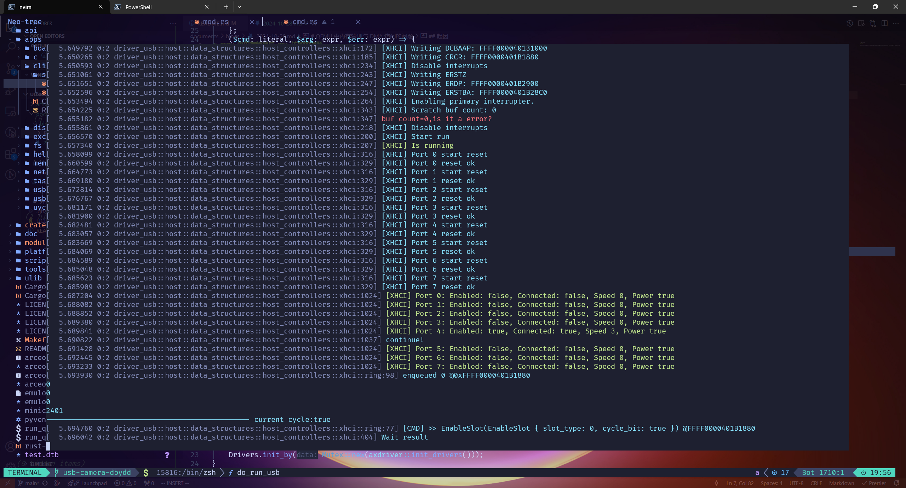
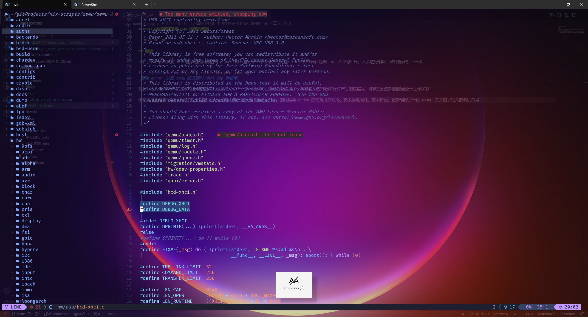
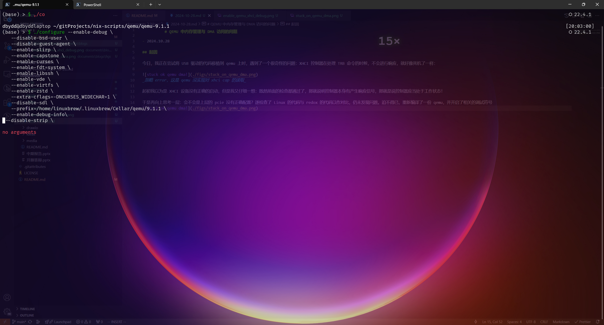
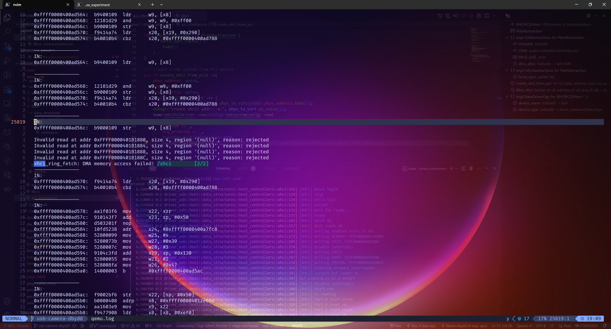

# QEMU 中内存管理与 DMA 访问的问题

- 2024.10.28

## 起因

今日，我正在尝试将 USB 驱动的代码移植到 qemu 上时，遇到了一个很奇怪的问题：XHCI 控制器在处理 TRB 命令的时候，不会进行响应，就好像死机了一样：


_忽略 error，这是 qemu 没实现对 xhci cap 的读取_

起初我以为是 XHCI 设备没有正确的启动，但是我又仔细一想：既然前面的检查都通过了，那就说明控制器本身有产生响应信号，那就是说控制器应当处于工作状态！

于是再向上思考一层：会不会是上层的 pcie 没有正确配置？遂检查了 Linux 的代码与 redox 的代码以作对比，仍未发现问题。迫不得已，重新编译了一份 qemu，并开启了相关的调试符号



在经过如此折腾后，重新进入模拟器，并查看[输出日志](./refs/qemu_1.log)


问题显露出端倪了：DMA memory access failed?什么鬼？

## 经过

于是上网查询相关资料，最终定位到了 qemu 于 2022 年的一份 [patch](https://lore.kernel.org/qemu-devel/20220802134834.454749-1-thuth@redhat.com/)

```email
From: Thomas Huth <thuth@redhat.com>
To: Gerd Hoffmann <kraxel@redhat.com>, qemu-devel@nongnu.org
Cc: mcascell@redhat.com, f4bug@amsat.org
Subject: [PATCH] hw/usb/hcd-xhci: Fix endless loop in case the DMA access fails (CVE-2020-14394)
Date: Tue,  2 Aug 2022 15:48:34 +0200	[thread overview]
Message-ID: <20220802134834.454749-1-thuth@redhat.com> (raw)

The XHCI code could enter an endless loop in case the guest points
QEMU to fetch TRBs from invalid memory areas. Fix it by properly
checking the return value of dma_memory_read().

Resolves: https://gitlab.com/qemu-project/qemu/-/issues/646
Signed-off-by: Thomas Huth <thuth@redhat.com>
```

打印内容正确，函数名正确，都是因为你！

等等，CVE？这还是个安全漏洞？仔细看看：[CVE-2020-14394](https://bugzilla.redhat.com/show_bug.cgi?id=1908004)

```comment
An infinite loop issue was found in the USB xHCI controller emulation of QEMU. Specifically, function xhci_ring_chain_length() in hw/usb/hcd-xhci.c may get stuck while fetching TRBs from guest memory, since the exit conditions of the loop depend on values that are fully controlled by guest. A privileged guest user may exploit this issue to hang the QEMU process on the host, resulting in a denial of service.
```

"A privileged guest user may exploit this issue to hang the QEMU process on the host, resulting in a denial of service."..."privileged"？？感觉自己好像无辜中枪了(Arceos 作为 Unikernel，并无用户态于内核态的区别)

所以，这玩意要咋修呢？让我仔细看看这里所提到的代码是怎么回事...

```c
static int xhci_ring_chain_length(XHCIState *xhci, const XHCIRing *ring)
{
//...
        if (dma_memory_read(xhci->as, dequeue, &trb, TRB_SIZE,
                        MEMTXATTRS_UNSPECIFIED) != MEMTX_OK) {
            qemu_log_mask(LOG_GUEST_ERROR, "%s: DMA memory access failed!\n",
                          __func__);
            return -1;
        }
///...
}
```

事实上，其他的错误信息也都是出在了这个方法上，深入研究一下。

```c
/**
 * dma_memory_read: Read from an address space from DMA controller.
 *
 * Return a MemTxResult indicating whether the operation succeeded
 * or failed (eg unassigned memory, device rejected the transaction,
 * IOMMU fault).  Called within RCU critical section.
 *
 * @as: #AddressSpace to be accessed
 * @addr: address within that address space
 * @buf: buffer with the data transferred
 * @len: length of the data transferred
 * @attrs: memory transaction attributes
 */
static inline MemTxResult dma_memory_read(AddressSpace *as, dma_addr_t addr,
                                          void *buf, dma_addr_t len,
                                          MemTxAttrs attrs)
{
    return dma_memory_rw(as, addr, buf, len,
                         DMA_DIRECTION_TO_DEVICE, attrs);
}
```

看来关键是 MemTxResult，此函数的返回值里有记载着错误信息:

```c
/* New-style MMIO accessors can indicate that the transaction failed.
 * A zero (MEMTX_OK) response means success; anything else is a failure
 * of some kind. The memory subsystem will bitwise-OR together results
 * if it is synthesizing an operation from multiple smaller accesses.
 */
#define MEMTX_OK 0
#define MEMTX_ERROR             (1U << 0) /* device returned an error */
#define MEMTX_DECODE_ERROR      (1U << 1) /* nothing at that address */
#define MEMTX_ACCESS_ERROR      (1U << 2) /* access denied */
typedef uint32_t MemTxResult;
```

让我们改一下代码看看在这里到底是返回了什么：

```c
    //修改样例
    MemTxResult res = dma_memory_read(xhci->as, ring->dequeue, trb, TRB_SIZE, MEMTXATTRS_UNSPECIFIED);
    if (res != MEMTX_OK) {
      qemu_log_mask(LOG_GUEST_ERROR, "%s: DMA memory access failed! code:%x\n",
        __func__, res);
      return 0;
    }
```

修改后的[输出](./refs/qemu_2.log)为：

```log
IN:
0xffffff800024445f:  48 89 01                 movq     %rax, (%rcx)

Invalid read at addr 0xFFFFFF80002E3080, size 4, region '(null)', reason: rejected
Invalid read at addr 0xFFFFFF80002E3084, size 4, region '(null)', reason: rejected
Invalid read at addr 0xFFFFFF80002E3088, size 4, region '(null)', reason: rejected
Invalid read at addr 0xFFFFFF80002E308C, size 4, region '(null)', reason: rejected
xhci_er_reset: DMA memory access failed! code:2
```

事实上，可以观察到 Code 皆为 2，即"#define MEMTX*DECODE_ERROR (1U << 1) /* nothing at that address \_/"。但是在 qemu monitor 中读取对应的地址，的确能读取出对应的数据，由此看来，可能依然是 cache 的问题！
